## Objective 
Aim of the present study is to evaluate the performance of a deep convolutional neural networks to detect and segment PET abnormalities in a large population of DLBCL.

## Material & Methods
[Proprocessing](https://github.com/paul-bd/GAINED_repo/blob/master/GAINED_load_and_resample.ipynb) to a 128x128x256 tensor of 4mm3 voxel
 
Dataset was splitted into a training (373 patients), a validation (92 patients) and a testing (93 patients) cohort
A U-net was trained with a custom loss function taking into accound the spectral hierarchy of PET images.

Main metrics were 
 - For the detection task : Sensitivity, PPV at the lesion levels. Sensitivity, Specificity, PPV, NPV at the voxel level
 - For the segmentation task : the Dice similarity coefficient (DSC)
 
## Results per patient
BLUE BOUNDING BOXES are False Negatives 
RED BOUNDING BOXES are False Positives
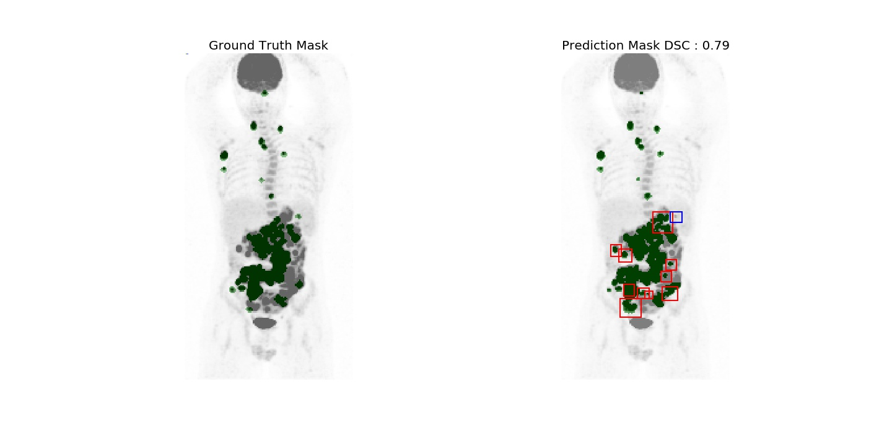
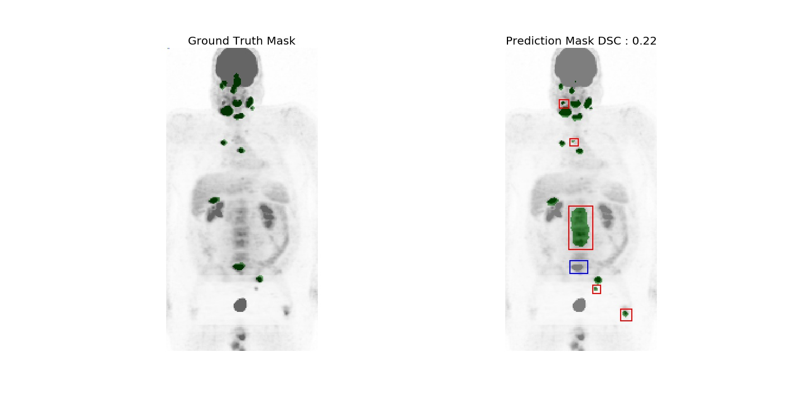
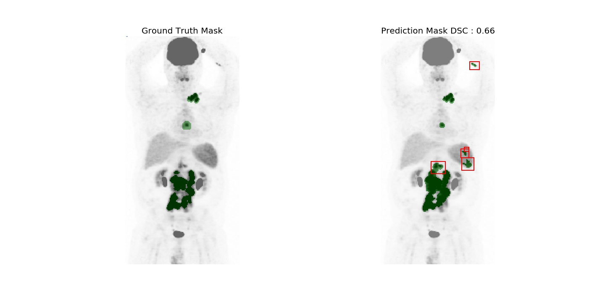
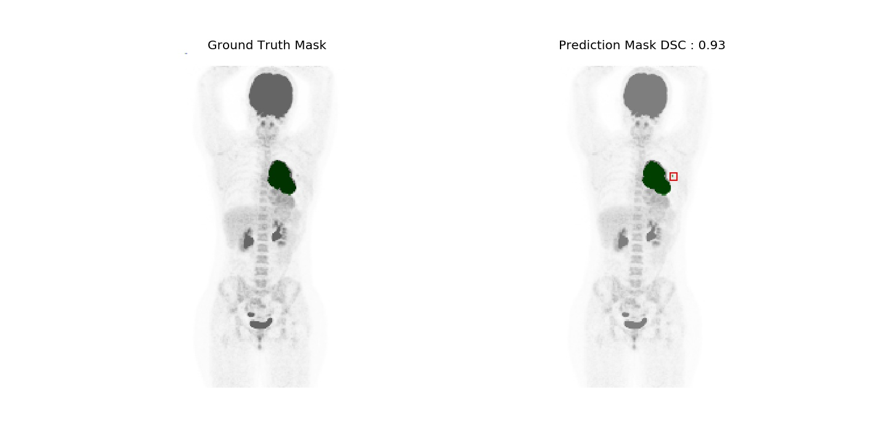
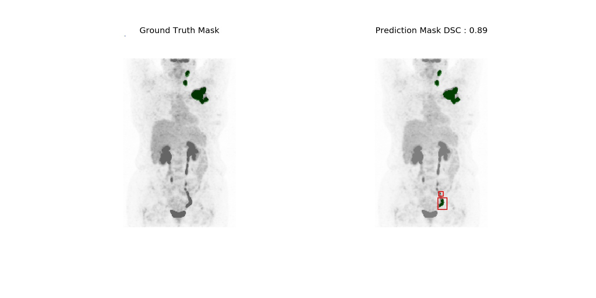
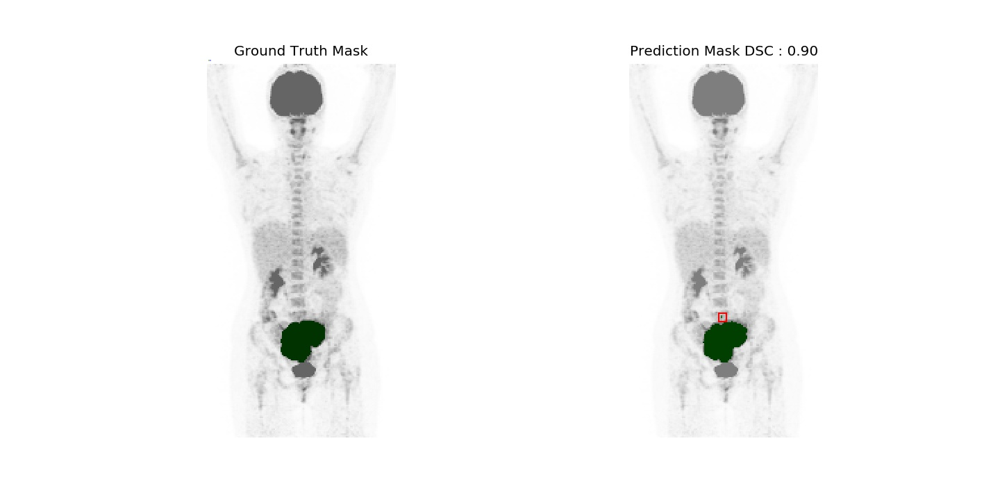
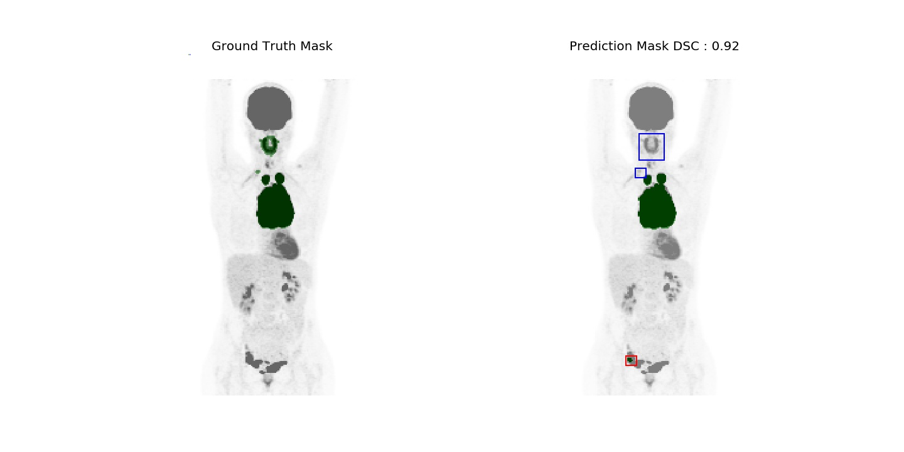
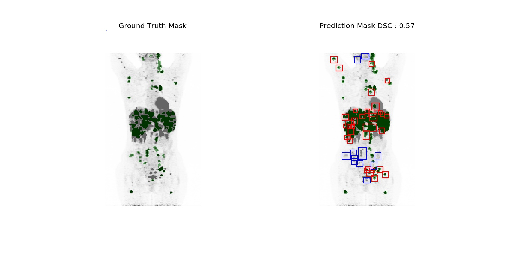

## Results in the validation cohort of 90 patients
Main results at the lesion / Voxel level

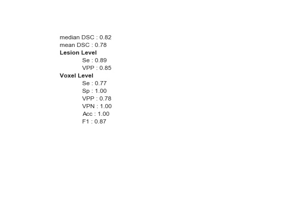

Distribution of DSC 

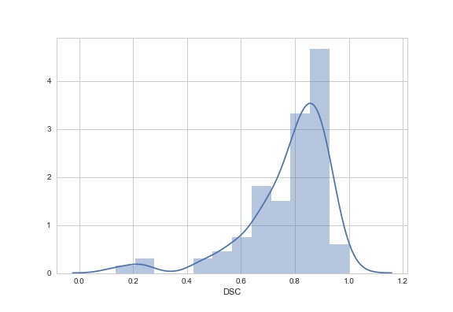

Scatter plot of MTV predicted / MTV ground truth

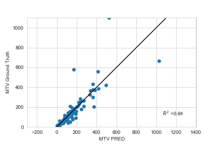

## Source Code : 
 - [GAINED Proprocessing](https://github.com/paul-bd/GAINED_repo/blob/master/GAINED_load_and_resample.ipynb) 
 - [Analysis of predictions](https://github.com/paul-bd/GAINED_repo/blob/master/check_preds.ipynb)
