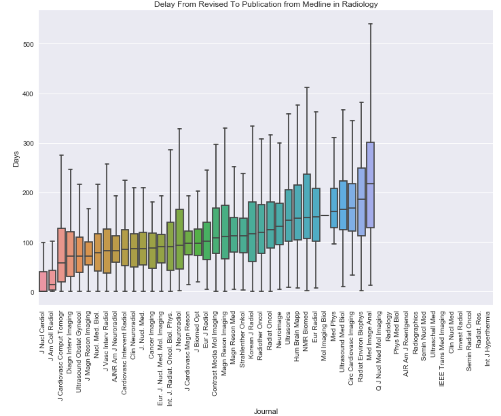

Time between manuscript reception to acceptance/publication for journals in nuclear medicine and radiology (including Radiology,Eur. J. Nucl. Med. Mol. Imaging, Circ Cardiovasc Imaging, J. Nucl. Med., Neuroimage, J Cardiovasc Magn Reson, Semin Radiat Oncol, Invest Radiol, Int. J. Radiat. Oncol. Biol. Phys., Ultrasound, Clin Nucl Med, Hum Brain Mapp, Radiother Oncol, Med Image Anal, Eur Radiol, IEEE Trans Med Imaging,J Nucl Cardiol...)

## Source Code : 
 - [Pubmed Scrapping and Code](https://github.com/paul-bd/Radiology_Pubmed/blob/master/Pubmed.ipynb)
